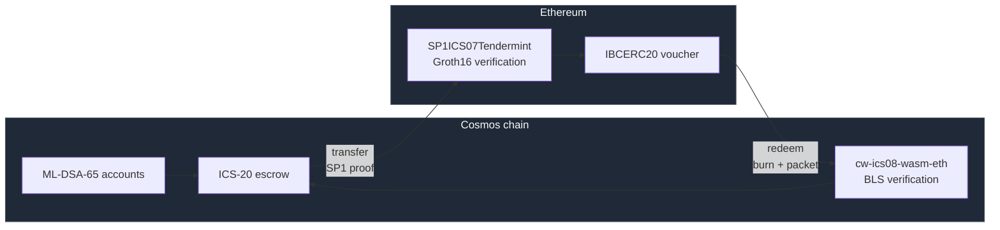

# pqc-migration

[](https://github.com/raaj2045/pqc-migration/actions/workflows/ci.yml)

A framework for migrating legacy blockchain accounts to post-quantum
signatures, together with the artefacts for the associated paper.

The chain runs on **stock Cosmos SDK v0.55 / CometBFT v0.40**, which ship native
**ML-DSA-65** account keys — no SDK fork required. It carries IBC v2 (Eureka)
and bridges to Ethereum through light clients on both sides, so cross-chain
transfers are verified against real consensus rather than a trusted relayer.
All asset transfer is ICS-20 over those clients; there is no custom bridge
module.

```bash
go build ./...
go test ./...
```

## How it fits together



Each chain verifies the other's consensus itself: Cosmos checks Ethereum's
sync-committee BLS signatures, and Ethereum checks an SP1 Groth16 proof of
Tendermint consensus. A relayer delivers proofs; it never asserts facts.

[Read the architecture →](docs/architecture.md)

## Documentation

| | |
|---|---|
| [Getting started](docs/getting-started.md) | Requirements, build, running the bridge |
| [Architecture](docs/architecture.md) | System design, transfer and redemption flows, trust model |
| [Devnet runbook](devnet/README.md) | Driving a full transfer and redemption cycle |
| [Testing and verification](docs/testing.md) | Fuzzing, formal verification, adversarial tests |
| [REPRODUCE](REPRODUCE.md) | Regenerating the paper's published results |

Reference notes: [Ethereum light client](docs/ethereum-light-client.md) ·
[wasmvm data directory](docs/wasm-data-dir.md) ·
[EVM deployment](devnet/deploy/README.md)

## Status

Everything in the tree builds and is covered by CI, except the ML-DSA-44
modules retained for historical reference — see [HISTORY.md](HISTORY.md).

## Project

[Contributing](CONTRIBUTING.md) · [Security policy](SECURITY.md) ·
[History and attribution](HISTORY.md)

See [CITATION.cff](CITATION.cff). Licensed under Apache 2.0 — see
[LICENSE](LICENSE).
