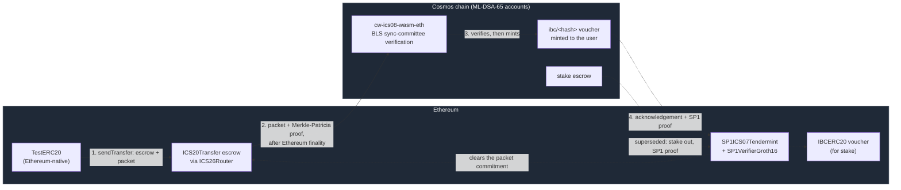

# Architecture

How the system works: two chains, two light clients, and asset transfer that is
verified by consensus rather than trusted to a relayer.

- [Getting started](getting-started.md) — build and run it
- [Testing and verification](testing.md) — what is tested and what that proves
- [Back to the project README](../README.md)

## The chain

A Cosmos chain built on **stock Cosmos SDK v0.55 / CometBFT v0.40**, which ship
native **ML-DSA-65** account keys. No SDK fork is required.

ML-DSA-65 is used for **account and transaction signatures**. Validator
consensus keys remain Ed25519 — the post-quantum change is at the account
layer, which is where migration matters and where the signature scheme is
user-visible.

An ante handler rejects malformed ML-DSA-65 public keys before they reach
address derivation, which would otherwise panic on a key of the wrong length.

## Asset transfer

Transfer is **ICS-20 over IBC v2 (Eureka)**. There is no custom bridge module:
`x/lockandmint` was retired, and all cross-chain value movement now goes through
standard ICS-20 packets whose proofs are checked by light clients on both sides.

Assets move in both directions, and which chain holds the escrow depends on
where the asset was issued:

| Asset | Escrowed on | Voucher on | Role |
|---|---|---|---|
| Ethereum-native ERC-20 (`TestERC20`) | Ethereum | Cosmos, as `ibc/<hash>` | **The migration the paper measures** |
| Cosmos-native `stake` | Cosmos | Ethereum, as `IBCERC20` | Supported; measured earlier, now superseded |

Vouchers are minted automatically on first receipt, with no pre-registration on
either side. The escrowed original is locked, never burned, so total supply is
unchanged and each voucher is a claim on what is held.

## The two light clients

Each chain verifies the other's consensus itself. Neither direction trusts a
relayer; a relayer can only deliver proofs, never assert facts.

| Direction | Verified on | Client | Verifies |
|---|---|---|---|
| Ethereum → Cosmos | Cosmos | `cw-ics08-wasm-eth` (inside 08-wasm) | BLS signatures of the 512-key sync committee |
| Cosmos → Ethereum | Ethereum | `SP1ICS07Tendermint` | An SP1 Groth16 proof of Tendermint consensus |

The migration path — an Ethereum-native asset moving to Cosmos — is drawn solid.
The acknowledgement that closes it, and the superseded Cosmos-native path, are
dashed.

### Ethereum → Cosmos

`cw-ics08-wasm-eth` runs as an 08-wasm client and performs real on-chain BLS
verification of the Ethereum sync committee. It is **finality-bound**: a packet
cannot be proved until Ethereum finality covers the execution block containing
it, roughly two epochs.

Two details govern correctness and are easy to supply wrongly — see
[Ethereum light client](ethereum-light-client.md):

- the consensus state's `state_root` is the **execution** state root, not the
  beacon one;
- `pubkeys_hash` is **supplied by the caller** and must be derived by SSZ
  hashing the sync committee, then validated against the bootstrap's branch.

### Cosmos → Ethereum

`SP1ICS07Tendermint` verifies Cosmos state from an SP1 Groth16 proof. The
verifier contract it uses is fixed **at client creation**:

| Verifier | Behaviour |
|---|---|
| `SP1VerifierGroth16` | Proofs are cryptographically verified on chain. |
| `SP1MockVerifier` | Accepts any public values with an empty proof. No verification. |

A client cannot be switched between them afterwards; create a second client
instead. The mock exists so the bridge can be driven without a prover during
development — it provides no security and must not be read as one.

The client stores four program verification keys, one per SP1 program
(`update_client`, `membership`, `update_client_and_membership`,
`misbehaviour`). These are derived from the compiled program ELFs, so a client
and the prover that serves it are bound to the same programs. Submitting a
proof whose key does not match is rejected with `VerificationKeyMismatch`; a
proof whose body does not satisfy the circuit is rejected by the Groth16 pairing
check with `ProofInvalid`.

Client creation therefore goes through **proof-api**, which derives the keys
from the ELFs and reads trusted state from a live light block, returning
deployment calldata. See [devnet/README.md](../devnet/README.md#proving).

## Migration flow: Ethereum → Cosmos

The direction the paper is about, measured in
[`experiments/migration_cost/`](../experiments/migration_cost/README.md). Run a
single cycle by hand with the
[native-asset cycle](../devnet/README.md#native-asset-cycle).

1. **Escrow (Ethereum).** The user calls `ICS20Transfer.sendTransfer` with an
   Ethereum-native ERC-20. The tokens go into escrow and `ICS26Router` writes a
   packet commitment into Ethereum storage.
2. **Wait for finality (Ethereum).** The packet cannot be proved until Ethereum
   finality covers the block containing it — roughly two epochs, about 540 s on
   the devnet.
3. **Update the light client (Cosmos).** `MsgUpdateClient` makes
   `cw-ics08-wasm-eth` BLS-verify the sync committee and store the finalized
   execution state root.
4. **Receive and mint (Cosmos).** `MsgRecvPacket` carries a Merkle-Patricia
   proof of the commitment, fetched with `eth_getProof`. The light client
   verifies it against the stored root, ICS-20 mints the `ibc/<hash>` voucher to
   the receiver, and the acknowledgement is written in the same transaction.
5. **Acknowledge (Ethereum).** proof-api proves the acknowledgement with SP1;
   `SP1ICS07Tendermint` verifies it and `ICS26Router` clears the packet
   commitment, closing the migration.

## Cosmos-native transfer flow: Cosmos → Ethereum

The opposite direction, for `stake`. Measured earlier in
[`experiments/batch_scaling/`](../experiments/batch_scaling/README.md), which
is superseded and is not the paper's migration result.

1. **Send.** A `MsgTransfer` on Cosmos escrows `stake` and commits a packet.
   The packet must carry `encoding: application/x-solidity-abi`, since the EVM
   counterparty decodes nothing else.
2. **Relay.** proof-api produces one `ICS26Router` multicall containing the
   client update and the packet membership proof, each with an SP1 proof.
3. **Receive.** `SP1ICS07Tendermint` verifies both against the Groth16 verifier;
   `ICS20Transfer` mints the IBCERC20 voucher and writes an acknowledgement.
4. **Acknowledge.** The acknowledgement is proved back to Cosmos, closing the
   packet.

## Redemption flow: `stake` back to Cosmos

1. **Burn.** `ICS20Transfer` recognises the voucher's denom as returning to
   source, burns it, and emits a packet back to Cosmos.
2. **Prove to Cosmos.** Once Ethereum finality covers the burn, the light client
   is advanced and `MsgRecvPacket` unescrows on Cosmos.
3. **Acknowledge.** The acknowledgement is proved back to Ethereum with an SP1
   proof, clearing the packet commitment.

### Replay protection

Resubmitting an identical proof is an **idempotent no-op, not an error**. The
transaction returns `code 0` and consumes gas, but the packet receipt prevents
any state change: no token callback, no second acknowledgement, balances
unmoved. Replay safety comes from the packet receipt, not from an
application-level identifier check.

## Repository layout

| Path | Contents |
|---|---|
| `app/` | Application wiring, including the `emptyValueDB` store fix |
| `cmd/pqchaind/` | Node binary |
| `devnet/` | Devnet tooling: deployment, relayer, transfer and redemption steps |
| `docs/` | This documentation, and the live-path formal verification |
| `security/` | Fuzzing and adversarial light-client tests |
| `benchmarks/` | Signature, block-packing and storage measurements, with plot scripts |
| `experiments/migration_cost/` | **Current.** Ethereum → Cosmos migration: cost, time and rate, by batch size and signing key type |
| `experiments/batch_scaling/` | **Superseded.** Cosmos → Ethereum transfers of `stake` against the mock SP1 verifier; the opposite direction, not the paper's migration result |
| `experiments/` (others) | Validator scaling, the live-bridge throughput run and cold sync — see [experiments/README.md](../experiments/README.md) |
| `tools/` | Simulators and load-generation tooling |

---

[Project README](../README.md) · [Getting started](getting-started.md) · [Testing](testing.md) · [Devnet](../devnet/README.md)
